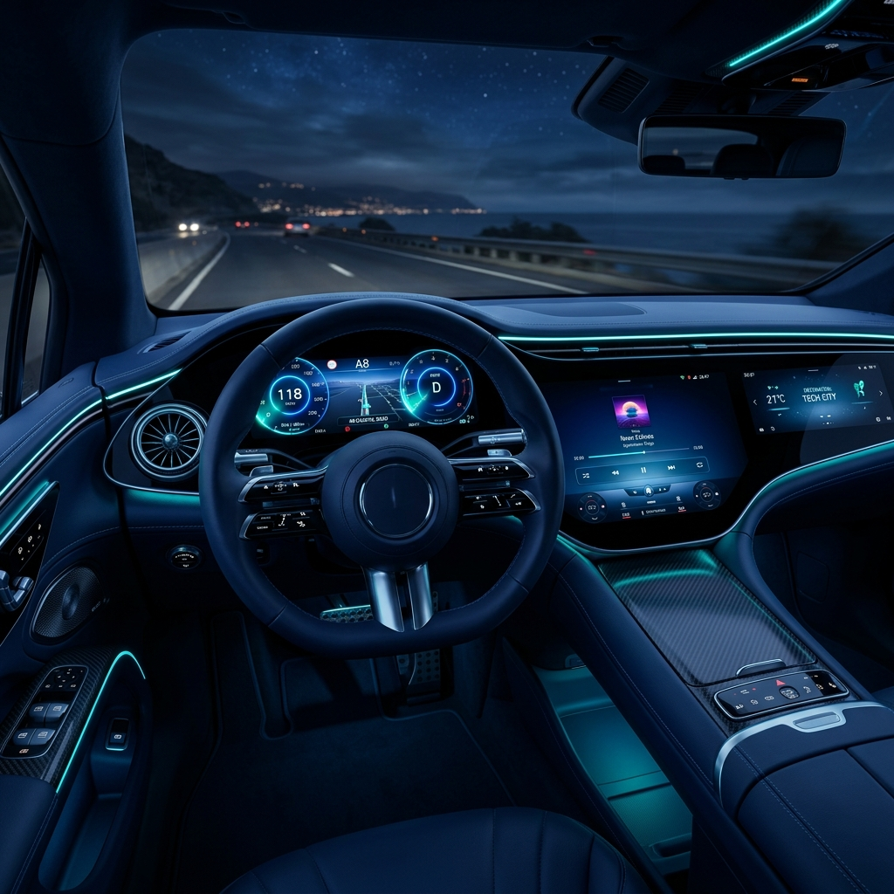

# VoltSave ⚡

**VoltSave** is a premium, modern EV Savings Calculator designed to help users transition to a sustainable future by visualizing the significant cost benefits of switching from petrol/diesel to electric vehicles.



## 🌟 Key Features

- **Intuitive Calculations**: Compare fuel expenses vs. energy costs based on your odometer reading.
- **Smart EV Efficiency**: Automatically calculates kWh/100km efficiency based on battery capacity and actual range.
- **Localized for India**: Default currency set to **INR (₹)** with realistic local rates for petrol/diesel and electricity.
- **Premium UI/UX**: High-fidelity dark blue theme with glassmorphism, smooth animations (Framer Motion), and responsive design.
- **Real-time Insights**: Live percentage-based savings insights and cost-per-km breakdowns.

## 🛠️ Tech Stack

- **Framework**: [React 19](https://react.dev/)
- **Build Tool**: [Vite 6](https://vitejs.dev/)
- **Styling**: [Tailwind CSS v4](https://tailwindcss.com/)
- **Animations**: [Framer Motion](https://www.framer.com/motion/)
- **Icons**: [Lucide React](https://lucide.dev/)
- **Typography**: [Inter](https://fonts.google.com/specimen/Inter) & [Outfit](https://fonts.google.com/specimen/Outfit)

## 📊 How It Works

### Calculations
1. **Petrol/Diesel Cost**: `(Distance / Mileage) * Fuel Price`
2. **EV Efficiency**: `(Battery Capacity / Actual Range) * 100`
3. **EV Cost**: `(Distance * (Efficiency / 100)) * Electricity Rate`
4. **Total Savings**: `Petrol/Diesel Cost - EV Cost`

### Local Defaults
- **Petrol/Diesel**: ₹105/Litre
- **Electricity**: ₹8/kWh
- **Mileage**: 15 km/L

## 🚀 Getting Started

1. **Clone the repository**:
   ```bash
   git clone https://github.com/0nlyjs/Ev-Savings-Calculator.git
   ```

2. **Install dependencies**:
   ```bash
   npm install
   ```

3. **Run the development server**:
   ```bash
   npm run dev
   ```

4. **Build for production**:
   ```bash
   npm run build
   ```

## 📄 License

This project is licensed under the MIT License.

---

Built with ❤️ for a greener planet.
